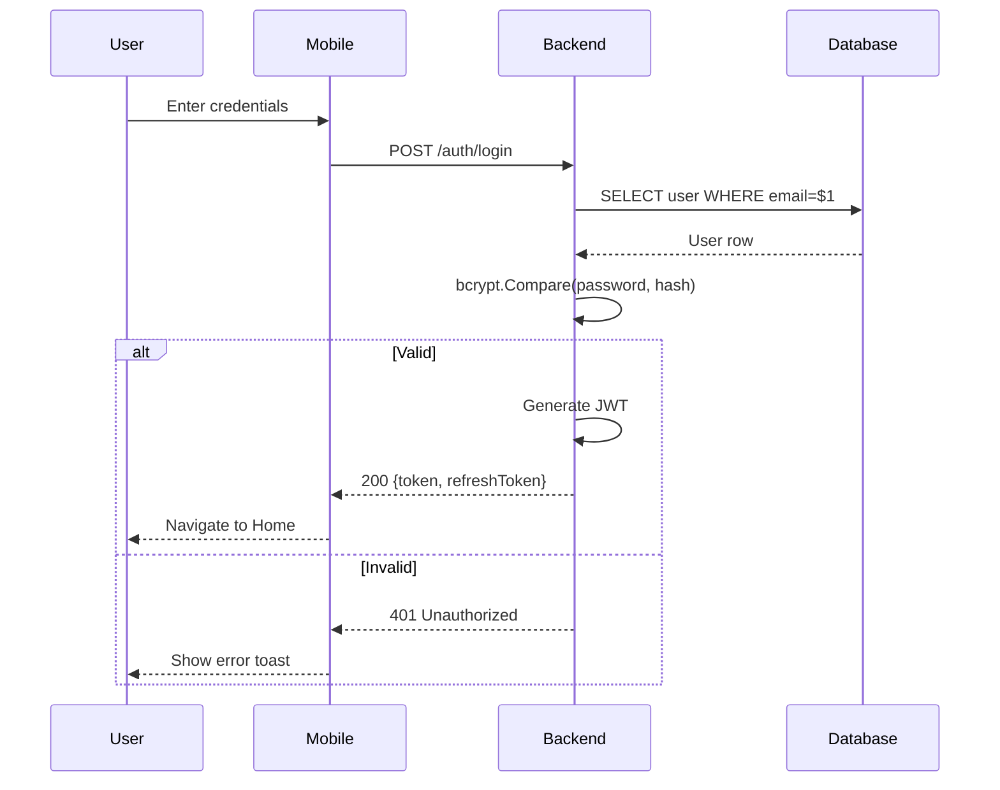

# Xenios Platform - Claude Code Instructions

## Architecture: Clean Architecture (MANDATORY)

This monorepo enforces Clean Architecture across all apps.
**Dependencies flow INWARD only.**

### System Architecture

```
┌─────────────────────────────────────────────────────────────────────┐
│                         CLEAN ARCHITECTURE                          │
│                    (Applied to EACH app separately)                 │
├─────────────────────────────────────────────────────────────────────┤
│                                                                     │
│   ┌─────────────┐      ┌─────────────┐      ┌─────────────┐        │
│   │   Mobile    │      │     Web     │      │   Backend   │        │
│   │ (API Client)│─────▶│ (API Client)│─────▶│ (Database)  │        │
│   └─────────────┘      └─────────────┘      └─────────────┘        │
│         │                    │                    │                 │
│         ▼                    ▼                    ▼                 │
│   Infrastructure:      Infrastructure:      Infrastructure:        │
│   ApiUserRepository    ApiUserRepository    PostgresUserRepository │
│   (calls Backend API)  (calls Backend API)  (calls Supabase/pgx)   │
│                                                                     │
└─────────────────────────────────────────────────────────────────────┘

Web & Mobile: External dependency = Backend REST API
Backend: External dependency = Supabase (PostgreSQL)
```

### Layer Rules (All Apps)

1. **Domain Layer** (`domain/`)
   - Contains: Entities, Value Objects, Repository Interfaces
   - Dependencies: NONE (pure business logic)
   - Example: `User` entity, `UserRepository` interface
   - **Same across all apps** - can be shared via `packages/shared-types`

2. **Application Layer** (`application/` or `usecase/`)
   - Contains: Use Cases (application-specific business rules)
   - Dependencies: Domain only
   - Example: `CreateUserUseCase`, `AuthenticateUserUseCase`

3. **Infrastructure Layer** (`infrastructure/`)
   - Contains: External implementations
   - Dependencies: Domain, Application
   - **Differs per app:**

   | App           | Infrastructure Contains        | Example                  |
   | ------------- | ------------------------------ | ------------------------ |
   | Backend (Go)  | Database access (pgx, raw SQL) | `PostgresUserRepository` |
   | Web (Next.js) | API client (HTTP to Backend)   | `ApiUserRepository`      |
   | Mobile (RN)   | API client (HTTP to Backend)   | `ApiUserRepository`      |

4. **Presentation Layer** (`presentation/`, `adapter/handler/`)
   - Contains: UI components, HTTP handlers, CLI
   - Dependencies: Domain, Application, Infrastructure
   - **Differs per app:**

   | App           | Presentation Contains            |
   | ------------- | -------------------------------- |
   | Backend (Go)  | REST API handlers                |
   | Web (Next.js) | React components, pages          |
   | Mobile (RN)   | React Native screens, components |

## TDD Requirements (MANDATORY)

1. **Test First**: Write failing test before implementation
2. **Red-Green-Refactor**:
   - RED: Write failing test
   - GREEN: Minimum code to pass
   - REFACTOR: Clean up while tests pass
3. **Coverage**: Minimum 80% for all new code
4. **Test Naming**: `Test<Function>_<Scenario>_<Expected>`

### File Patterns

- Go tests: `*_test.go` in same package
- TS tests: `*.test.ts` or `*.spec.ts`
- Test fixtures: `testdata/` or `__fixtures__/`

## Database: Backend-Only Access (MANDATORY)

**ONLY the Backend (Go) accesses the database. Web and Mobile call the Backend API.**

### Clean Architecture + Data Access (Per App)

**Backend (Go) - Infrastructure = Database**

```
┌─────────────────────────────────────────────────────────────────────┐
│  DOMAIN: UserRepository interface { FindByID(id) (*User, error) }   │
├─────────────────────────────────────────────────────────────────────┤
│  APPLICATION: GetUserUseCase { repo.FindByID(id) }                  │
├─────────────────────────────────────────────────────────────────────┤
│  INFRASTRUCTURE: PostgresUserRepository                             │
│    → db.QueryRow("SELECT * FROM users WHERE id = $1", id)          │
│    → Raw SQL with pgx (talks to Supabase)                          │
├─────────────────────────────────────────────────────────────────────┤
│  PRESENTATION: HTTP Handler                                         │
│    → GET /api/users/:id → calls GetUserUseCase                     │
└─────────────────────────────────────────────────────────────────────┘
```

**Web & Mobile (TypeScript) - Infrastructure = API Client**

```
┌─────────────────────────────────────────────────────────────────────┐
│  DOMAIN: UserRepository interface { findById(id): Promise<User> }   │
├─────────────────────────────────────────────────────────────────────┤
│  APPLICATION: GetUserUseCase { repo.findById(id) }                  │
├─────────────────────────────────────────────────────────────────────┤
│  INFRASTRUCTURE: ApiUserRepository                                  │
│    → apiClient.get('/api/users/' + id)                             │
│    → HTTP call to Backend (NO database access!)                    │
├─────────────────────────────────────────────────────────────────────┤
│  PRESENTATION: React Component / React Native Screen                │
│    → useQuery() → calls GetUserUseCase                             │
└─────────────────────────────────────────────────────────────────────┘
```

### Database Rules

**All Apps (Clean Architecture):**

1. **Repository interfaces in Domain** - Define WHAT, not HOW
2. **Repository implementations in Infrastructure** - External access here only
3. **Dependency injection** - Use cases receive interfaces, not concrete repos
4. **No cross-layer imports** - Domain never imports Infrastructure

**Backend Only:** 5. **Raw SQL only** - No ORMs (GORM, Ent, Prisma, etc.) 6. **Prepared statements** - Always use parameterized queries ($1, $2) 7. **Migrations** - Raw SQL files, applied via CI/CD

**Web & Mobile Only:** 8. **API Client only** - Infrastructure calls Backend API, never database 9. **No database libraries** - No @supabase, pg, prisma, typeorm, etc. 10. **Shared API client** - Use `@xenios/api-client` package

### Allowed Libraries

| App                       | Allowed                       | Forbidden                 |
| ------------------------- | ----------------------------- | ------------------------- |
| **Backend (Go)**          | `database/sql`, `pgx`, `sqlx` | GORM, Ent, Bun, SQLBoiler |
| **Web (Next.js)**         | `fetch`, `axios`, API client  | **ALL database libs**     |
| **Mobile (React Native)** | `fetch`, `axios`, API client  | **ALL database libs**     |

## Version Verification (MANDATORY)

**Your knowledge about package versions may be outdated. ALWAYS verify before using.**

Before specifying ANY version of a package, framework, or runtime:

1. **CHECK the official documentation** for the current LTS/stable version:
   - Node.js: https://nodejs.org/
   - Go: https://go.dev/dl/
   - Next.js: https://nextjs.org/docs
   - React Native: https://reactnative.dev/

2. **Check existing project files** for version hints:
   - `package.json` → `engines.node` field
   - `go.mod` → Go version
   - `.nvmrc` or `.node-version` → Node version

3. **When uncertain**:
   - Make a reasonable choice using the latest stable/LTS version
   - Document the assumption in the PR description
   - In CI (non-interactive): never stop to ask, always proceed with best guess

## Forbidden Patterns

**Clean Architecture Violations (All Apps):**

- Domain layer importing from Infrastructure
- Use Cases importing external specifics (HTTP, DB, API client)
- Use Cases directly instantiating repository implementations
- Circular dependencies between modules
- Business logic in handlers/controllers/components

**Backend (Go) Violations:**

- Using any ORM (GORM, Ent, Prisma, TypeORM, Drizzle, etc.)
- Raw SQL without parameterized queries (SQL injection risk)
- Database imports (pgx, sql) in domain or usecase layers

**Web & Mobile (TypeScript) Violations:**

- Importing ANY database library (@supabase, pg, prisma, mysql, mongodb, etc.)
- Accessing database directly (bypassing Backend API)
- API client imports in domain or application layers

## Before Making Changes

1. Identify which layer the change belongs to
2. Write tests for the expected behavior
3. Implement the minimum code to pass tests
4. Verify no layer violations introduced
5. Run full test suite before committing

## Database Migrations (MANDATORY)

### Migration File Structure

```
apps/backend/migrations/
├── 001_create_users.up.sql
├── 001_create_users.down.sql
├── 002_create_sessions.up.sql
├── 002_create_sessions.down.sql
└── ...
```

### Migration Rules

1. **Raw SQL only** - No migration tools that generate SQL (no goose, migrate CLI generators)
2. **Sequential numbering** - `NNN_description.up.sql` and `NNN_description.down.sql`
3. **Idempotent** - Use `IF NOT EXISTS`, `IF EXISTS` where possible
4. **Reversible** - Every `.up.sql` must have a matching `.down.sql`
5. **No data loss** - Down migrations should preserve data when possible
6. **One concern per migration** - Don't mix table creation with data seeding
7. **Parameterized** - Never interpolate user values into migration SQL
8. **Applied via CI/CD** - The `migrate-db.yml` workflow handles staging and production

### Migration Examples

```sql
-- 001_create_users.up.sql
CREATE TABLE IF NOT EXISTS users (
    id UUID PRIMARY KEY DEFAULT gen_random_uuid(),
    email TEXT NOT NULL UNIQUE,
    password_hash TEXT NOT NULL,
    created_at TIMESTAMPTZ NOT NULL DEFAULT now(),
    updated_at TIMESTAMPTZ NOT NULL DEFAULT now()
);

CREATE INDEX IF NOT EXISTS idx_users_email ON users(email);
```

```sql
-- 001_create_users.down.sql
DROP TABLE IF EXISTS users;
```

## CI/CD Automation (MANDATORY)

This project uses AI-powered GitHub Actions for automated development.

### Workflow Pipeline

```
PRD → Architect → Issues → Builder → PRs → Reviewer → TDD Gate → Deploy
                                                          ↓
                                              Architect Monitor
                                              (batch completion)
```

### Workflows

| Workflow | Trigger | Purpose |
|----------|---------|---------|
| `claude-architect.yml` | `workflow_dispatch`, `@claude-architect` | Analyzes PRDs, creates issues in batches |
| `claude-architect-monitor.yml` | `issues: [closed]` | Detects batch completion, notifies for next batch |
| `claude-implement.yml` | `issues: [labeled]` with `claude-implement` | Implements features via TDD, creates PRs |
| `claude-review.yml` | `pull_request`, `@claude-review` | Reviews PRs, auto-approves if quality passes |
| `claude-fix.yml` | `issues: [labeled]` with `claude-fix` | Fixes bugs, creates PRs |
| `claude-assistant.yml` | `@claude` comment | General help on issues/PRs |
| `tdd-gate.yml` | `pull_request` to main/develop | Calibrated TDD quality scoring (100-point system) |
| `deploy-backend.yml` | Push to main | Deploy Go API to Fly.io |
| `deploy-web.yml` | Push to main | Deploy Next.js to Vercel |
| `deploy-mobile.yml` | Manual/tag release | Build via EAS |
| `migrate-db.yml` | Push to main (migrations/) | Run SQL migrations on Supabase |

### Non-Interactive CI Mode (CRITICAL)

All Claude workflows run in CI with **NO human interaction**. When running in GitHub Actions:

- **NEVER stop to ask for clarification** - Make reasonable assumptions
- **ALWAYS document assumptions** in PR descriptions or issue comments
- **If requirements are ambiguous** - Choose the most common/standard approach
- **If you encounter a blocker** - Document it and implement as much as possible

### @ Commands

| Command | Where to Use | What It Does |
|---------|-------------|--------------|
| `@claude-architect next` | Master Plan issue comment | Creates the next batch of issues |
| `@claude-architect status` | Master Plan issue comment | Reports current progress |
| `@claude-review` | PR comment | Requests a re-review |
| `@claude` | Any issue/PR comment | General assistant help |

### Issue Labels

| Label | Applied By | Meaning |
|-------|------------|---------|
| `claude-implement` | Architect | Issue ready for Builder |
| `claude-fix` | Human | Bug for auto-fix |
| `architect-master-plan` | Architect | Master Plan tracking issue |
| `amendment` | Architect | PRD amendment issue |
| `batch/N` | Architect | Batch grouping |
| `size/XS,S,M,L` | Architect | Scope estimate |
| `priority/high,medium,low` | Architect | Priority level |
| `implementation-complete` | Builder | Implementation done |
| `review/approved` | Reviewer | PR approved |
| `review/changes-requested` | Reviewer | PR needs fixes |

### TDD Quality Gate Scoring

PRs are scored on a calibrated 100-point system:

| Component | Max | Method |
|-----------|-----|--------|
| Test Coverage | 30 | `go test -cover` / Jest |
| Test-Before-Code | 20 | Git commit order analysis |
| Test:Code Ratio | 15 | Line count comparison |
| Clean Architecture | 10 | Static import analysis |
| Edge Cases (LLM) | 15 | Claude with strict rubric |
| Error Handling (LLM) | 10 | Claude with strict rubric |

- **75 points deterministic** (repeatable across runs)
- **25 points LLM** (strict rubric, +/- 3 pts variance)
- **Pass threshold: 60/100**

## Sequence Diagram Requirements (MANDATORY)

Every **issue** created by the Architect and every **PR** created by the Builder MUST include a Mermaid sequence diagram.

### Diagrams Must Show

- Key actors: User, Mobile/Web, Backend, Database, External APIs
- Request and response flow
- Error/alternate paths with `alt`/`else` blocks

### Conventions

- Use short aliases: `U` (User), `M` (Mobile), `W` (Web), `B` (Backend), `DB` (Database)
- Request arrows: `->>`
- Response arrows: `-->>`
- Conditional flows: `alt`/`else`/`end`

### Example



## Project Structure

```
xenios/
├── apps/
│   ├── backend/           # Go API (Clean Architecture)
│   │   ├── cmd/api/       # Entry point
│   │   ├── internal/
│   │   │   ├── domain/    # Entities, repository interfaces
│   │   │   ├── usecase/   # Application business logic
│   │   │   ├── adapter/   # Handlers, repository implementations
│   │   │   └── infrastructure/  # Database, config
│   │   └── migrations/    # Raw SQL migrations
│   ├── web/               # Next.js (Clean Architecture)
│   │   └── src/
│   │       ├── domain/    # Entities, repository interfaces
│   │       ├── application/   # Use cases
│   │       ├── infrastructure/  # API repositories
│   │       └── presentation/    # Components, hooks
│   └── mobile/            # React Native (Clean Architecture)
│       └── src/           # Same structure as web
├── packages/
│   ├── shared-types/      # Common TypeScript types
│   ├── api-client/        # HTTP client for Backend API
│   └── ui-kit/            # Shared UI components
├── docs/
│   └── github-actions-workflow.md  # Full CI/CD documentation
└── .github/
    └── workflows/
        ├── claude-architect.yml          # PRD to issues
        ├── claude-architect-monitor.yml  # Batch completion
        ├── claude-implement.yml          # Feature implementation
        ├── claude-review.yml             # PR review & auto-approve
        ├── claude-fix.yml                # Bug fixes
        ├── claude-assistant.yml          # General assistant
        ├── tdd-gate.yml                  # TDD quality scoring
        ├── deploy-backend.yml            # Fly.io deployment
        ├── deploy-web.yml                # Vercel deployment
        ├── deploy-mobile.yml             # EAS Build
        └── migrate-db.yml               # Database migrations
```

## Git Workflow

**NEVER use `git add -A` or `git add .`** - Always add files explicitly.

Commit messages format:

```
[Feature] Brief description
[Bug] Fix description
[Chore] Maintenance description
```
