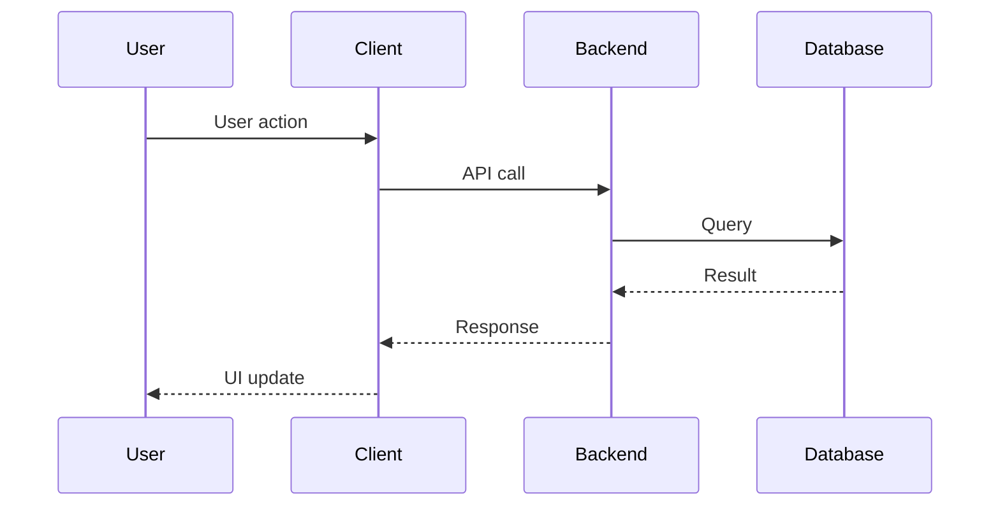
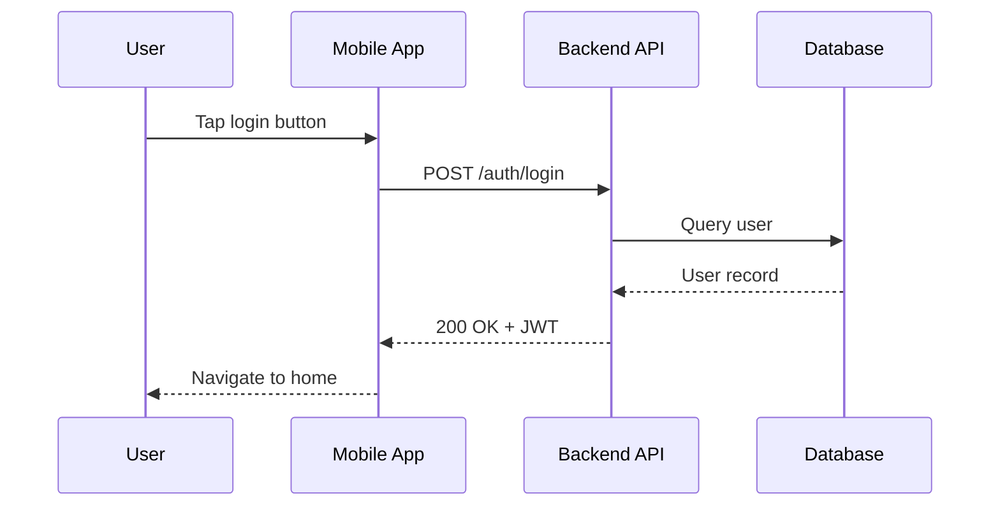

# Xenios AI-Powered CI/CD Workflow

This document describes the complete GitHub Actions workflow for the Xenios platform, featuring AI-powered automation from PRD to production.

## Overview

```
┌─────────────────────────────────────────────────────────────────────────────┐
│                        XENIOS AI CI/CD PIPELINE                             │
└─────────────────────────────────────────────────────────────────────────────┘

    📄 PRD Document
         │
         ▼
┌─────────────────────┐
│  CLAUDE ARCHITECT   │  Analyzes requirements, creates issues in batches
│  claude-architect   │
└─────────┬───────────┘
          │ Creates issues with
          │ label: claude-implement
          ▼
┌─────────────────────┐
│   CLAUDE BUILDER    │  Implements features using TDD
│  claude-implement   │
└─────────┬───────────┘
          │ Creates PRs
          ▼
┌─────────────────────┐
│  CLAUDE REVIEWER    │  Reviews code, auto-approves if quality passes
│   claude-review     │
└─────────┬───────────┘
          │ Approved PRs
          ▼
┌─────────────────────┐
│     TDD GATE        │  Validates tests pass, coverage meets threshold
│     tdd-gate        │
└─────────┬───────────┘
          │ Merge to main
          ▼
┌─────────────────────┐
│      DEPLOY         │  Deploy to staging/production
│   deploy-backend    │
│   deploy-web        │
│   deploy-mobile     │
└─────────────────────┘
```

## Workflows

### 1. Claude Architect (`claude-architect.yml`)

**Purpose**: Analyzes PRD documents and creates well-structured GitHub issues for implementation.

**Triggers**:
| Trigger | Use Case |
|---------|----------|
| `workflow_dispatch` | Manual trigger from GitHub UI with PRD URL or content |
| `issue_comment` | `@claude-architect` commands on Master Plan issues |

**Inputs**:
| Input | Description | Default |
|-------|-------------|---------|
| `prd_url` | URL to PRD document | - |
| `prd_content` | Paste PRD content directly | - |
| `mode` | `preview`, `draft`, or `create` | `create` |
| `priority` | `high`, `medium`, `low` | `medium` |
| `batch_action` | `new`, `next`, `amend`, `status` | `new` |
| `master_plan_issue` | Issue number for ongoing projects | - |

**Batch Actions**:
- **new**: Create Master Plan issue + Batch 1 foundation issues
- **next**: Create next batch of issues from Master Plan
- **amend**: Create amendment issues from PRD updates
- **status**: Report current project progress

**Issue Template**:
```markdown
## Summary
One-sentence description

## User Story
As a [role], I want [capability] so that [benefit].

## Acceptance Criteria
- [ ] Criterion 1
- [ ] Criterion 2

## Technical Notes
Architecture guidance, API contracts, data models

## Affected Apps
- [ ] Backend (Go)
- [ ] Web (Next.js)
- [ ] Mobile (React Native)

## Test Scenarios
1. **Happy path**: ...
2. **Edge case**: ...
3. **Error case**: ...

## Sequence Diagram


## Dependencies
Blocked by: #XX, #YY

## Scope
Size: M
```

**Labels Created**:
- `claude-implement` - Issues for Builder
- `architect-master-plan` - Master Plan tracking
- `amendment` - PRD amendment issues
- `batch/1` through `batch/5` - Batch grouping
- `size/XS`, `size/S`, `size/M`, `size/L` - Scope estimates
- `priority/high`, `priority/medium`, `priority/low` - Priority levels

---

### 2. Claude Architect Monitor (`claude-architect-monitor.yml`)

**Purpose**: Detects batch completion and notifies when ready for next batch.

**Trigger**: `issues: [closed]`

**Behavior**:
1. Triggers when any `claude-implement` labeled issue is closed
2. Finds the Master Plan issue
3. Checks if all issues in the current batch are closed
4. If batch complete:
   - Posts notification comment on Master Plan
   - Updates Master Plan checkboxes (🔄 → ✅)
   - Marks next batch as ready (⏳ → 🔄)
5. Posts progress updates at 50%+ completion

**Example Notification**:
```markdown
## 🎉 Batch 1 Complete!

All **7** issues in Batch 1 have been closed.

### Ready for Next Batch?

Comment `@claude-architect next` to create the next batch of issues.
```

---

### 3. Claude Builder (`claude-implement.yml`)

**Purpose**: Implements features following TDD and Clean Architecture.

**Trigger**: `issues: [labeled]` with label `claude-implement`

**Behavior**:
1. Reads issue description thoroughly
2. Identifies affected apps (Backend, Web, Mobile)
3. Follows Test-Driven Development:
   - Writes failing tests FIRST
   - Implements minimum code to pass
   - Refactors while keeping tests green
4. Creates PR with:
   - Clear description
   - Test coverage report
   - Screenshots for UI changes
   - Mermaid sequence diagram

**Architecture Rules Enforced**:
- Clean Architecture layers (Domain → Application → Infrastructure → Presentation)
- Dependencies flow inward only
- Domain layer has no external dependencies

**Database Rules (CRITICAL)**:
- ONLY Backend (Go) accesses database
- NO ORMs (GORM, Prisma, etc. are FORBIDDEN)
- Raw SQL with pgx/sqlx only
- Parameterized queries required

**PR Template**:
```markdown
## Summary
Brief description of changes

## Changes
- Change 1
- Change 2

## Test Coverage
- Unit tests: ✅
- Integration tests: ✅
- Coverage: 85%

## Sequence Diagram


## Screenshots
[If UI changes]

Closes #XX
```

---

### 4. Claude Reviewer (`claude-review.yml`)

**Purpose**: Reviews PRs and auto-approves if quality criteria pass.

**Triggers**:
| Trigger | Use Case |
|---------|----------|
| `pull_request: [opened, synchronize, ready_for_review]` | Automatic on every PR |
| `@claude-review` comment | Manual re-review request |

**Review Checklist** (scored 1-5):

| Category | What's Checked |
|----------|----------------|
| **Spec Compliance** | All acceptance criteria met, no scope creep |
| **Architecture** | Clean Architecture, dependencies flow inward |
| **Database Rules** | No ORMs, parameterized queries, Backend-only access |
| **Testing** | Tests exist, happy/edge/error paths covered |
| **Security** | No hardcoded secrets, SQL injection, XSS |
| **Sequence Diagram** | Present in PR, accurately shows flow |
| **Documentation** | Complex logic explained, no obvious comments |

**Auto-Approve Criteria**:
- ✅ No critical issues (no score of 1)
- ✅ Database Rules score ≥ 4
- ✅ Security score ≥ 4
- ✅ Overall average ≥ 3.5
- ✅ All acceptance criteria met (if linked issue)

**Auto-Reject (REQUEST_CHANGES)**:
- ❌ Any score of 1 (critical issue)
- ❌ ORM usage detected
- ❌ Direct database access from Web/Mobile
- ❌ Security vulnerabilities
- ❌ No tests for new functionality

**Review Output**:
```markdown
## 🔍 Claude Code Review

**PR**: #42 - Add user authentication
**Verdict**: ✅ APPROVE

### Scores

| Category | Score | Notes |
|----------|-------|-------|
| Spec Compliance | 5/5 | All criteria met |
| Architecture | 5/5 | Clean layers |
| Database Rules | 5/5 | Raw SQL, parameterized |
| Testing | 4/5 | Good coverage, missing edge case |
| Security | 5/5 | No issues |
| Sequence Diagram | 5/5 | Accurate and complete |
| Documentation | 4/5 | Good |
| **Overall** | **4.7/5** | |

### What's Good ✨
- Excellent test coverage
- Clean separation of concerns
- Proper error handling
```

**Labels Applied**:
- `review/approved` - PR approved
- `review/changes-requested` - Needs fixes
- `review/pending` - Review incomplete

---

### 5. TDD Gate (`tdd-gate.yml`)

**Purpose**: Validates tests pass and coverage meets threshold before merge.

**Trigger**: `pull_request` to main branch

**Checks**:
- All tests pass
- Coverage ≥ 80% for new code
- No regression in existing coverage

---

### 6. Claude Fix (`claude-fix.yml`)

**Purpose**: Automatically fixes issues reported in bug reports.

**Trigger**: `issues: [labeled]` with label `bug`

---

### 7. Deploy Workflows

#### Backend (`deploy-backend.yml`)
- **Trigger**: Push to main, changes in `apps/backend/`
- **Target**: Fly.io
- **Steps**: Build Go binary → Deploy to Fly.io

#### Web (`deploy-web.yml`)
- **Trigger**: Push to main, changes in `apps/web/`
- **Target**: Vercel
- **Steps**: Build Next.js → Deploy to Vercel

#### Mobile (`deploy-mobile.yml`)
- **Trigger**: Manual or tag release
- **Target**: EAS Build
- **Steps**: Build with Expo → Submit to stores

#### Database Migrations (`migrate-db.yml`)
- **Trigger**: Push to main, changes in `migrations/`
- **Target**: Supabase
- **Steps**: Run migrations on staging → Manual approval → Production

---

## Complete Flow Example

### 1. Human uploads PRD

```bash
# Via GitHub UI: Actions → Claude Architect → Run workflow
# Or via CLI:
gh workflow run claude-architect.yml \
  -f prd_url="https://raw.githubusercontent.com/.../PRD.md" \
  -f mode="create" \
  -f priority="high"
```

### 2. Architect creates Master Plan + Batch 1

**Master Plan Issue #100**:
```markdown
# 🏗️ Master Plan: User Authentication System

## Progress
- [ ] **Batch 1: Foundation** (Issues #101-#104) 🔄 In Progress
- [ ] **Batch 2: Features** (Issues pending) ⏳ Waiting
```

**Batch 1 Issues Created**:
- #101: Database Schema Setup
- #102: JWT Token Service
- #103: Login API Endpoint
- #104: Auth Middleware

### 3. Builder implements each issue

For each issue with `claude-implement` label:
1. Builder reads issue
2. Writes tests first
3. Implements feature
4. Creates PR with sequence diagram
5. Links to issue: "Closes #101"

### 4. Reviewer auto-approves

- Reviews PR #105 (implements #101)
- Checks all criteria
- Score: 4.5/5
- Verdict: ✅ APPROVE

### 5. TDD Gate validates

- All tests pass
- Coverage: 87%
- ✅ Ready to merge

### 6. Merge triggers deploy

- Backend changes → Deploy to Fly.io
- Web changes → Deploy to Vercel
- Migrations → Run on staging, then production

### 7. Monitor detects batch completion

When #101-#104 are all closed:
```markdown
## 🎉 Batch 1 Complete!

Comment `@claude-architect next` to create Batch 2.
```

### 8. Human triggers next batch

```
@claude-architect next
```

Architect creates Batch 2 issues, cycle repeats.

---

## Secrets Required

Add these to **Repository → Settings → Secrets and variables → Actions**:

| Secret | Description | How to Get |
|--------|-------------|------------|
| `CLAUDE_CODE_OAUTH_TOKEN` | Claude Code authentication | Run `claude /setup-token` |
| `FLY_API_TOKEN` | Fly.io deployment | `fly tokens create deploy` |
| `VERCEL_TOKEN` | Vercel deployment | vercel.com/account/tokens |
| `VERCEL_ORG_ID` | Vercel organization | vercel.com/account settings |
| `VERCEL_PROJECT_ID` | Vercel project | Project → Settings → General |
| `STAGING_DATABASE_URL` | Staging DB connection | Supabase dashboard |
| `PRODUCTION_DATABASE_URL` | Production DB connection | Supabase dashboard |

---

## Labels Reference

| Label | Applied By | Meaning |
|-------|------------|---------|
| `claude-implement` | Architect | Issue ready for Builder |
| `architect-master-plan` | Architect | Master Plan tracking issue |
| `amendment` | Architect | PRD amendment issue |
| `batch/N` | Architect | Batch grouping |
| `size/XS,S,M,L` | Architect | Scope estimate |
| `priority/high,medium,low` | Architect | Priority level |
| `implementation-complete` | Builder | Implementation done |
| `review/approved` | Reviewer | PR approved |
| `review/changes-requested` | Reviewer | PR needs fixes |
| `bug` | Human | Bug report (triggers claude-fix) |

---

## Commands Reference

### Architect Commands (comment on Master Plan)
- `@claude-architect next` - Create next batch of issues
- `@claude-architect status` - Get current progress report
- `@claude-architect amend` - Process PRD amendments

### Reviewer Commands (comment on PR)
- `@claude-review` - Request re-review of PR

### Manual Workflow Triggers
```bash
# Create issues from PRD
gh workflow run claude-architect.yml -f prd_url="URL" -f mode="create"

# Preview without creating
gh workflow run claude-architect.yml -f prd_content="Requirements..." -f mode="preview"

# Trigger next batch
gh workflow run claude-architect.yml -f batch_action="next" -f master_plan_issue="100"
```

---

## Troubleshooting

### Architect not creating issues
1. Check `mode` is set to `create` (not `preview`)
2. Verify `CLAUDE_CODE_OAUTH_TOKEN` secret is set
3. Check workflow logs for errors

### Builder not triggering
1. Verify issue has `claude-implement` label
2. Check if workflow is enabled in Actions tab
3. Ensure issue was just labeled (not previously labeled)

### Reviewer not approving
1. Check review scores in PR comment
2. Address any critical issues (score 1)
3. Ensure sequence diagram is present
4. Comment `@claude-review` to re-review after fixes

### Batch completion not detected
1. Verify all issues have `batch/N` label
2. Check Master Plan issue has `architect-master-plan` label
3. Ensure Master Plan format matches expected template

---

## Architecture Diagram

```
┌─────────────────────────────────────────────────────────────────────────┐
│                           GITHUB REPOSITORY                             │
├─────────────────────────────────────────────────────────────────────────┤
│  .github/workflows/                                                     │
│  ├── claude-architect.yml        # PRD → Issues                        │
│  ├── claude-architect-monitor.yml # Batch completion detection         │
│  ├── claude-implement.yml        # Issues → PRs                        │
│  ├── claude-review.yml           # PR review & auto-approve            │
│  ├── claude-fix.yml              # Bug fixes                           │
│  ├── tdd-gate.yml                # Test validation                     │
│  ├── deploy-backend.yml          # Fly.io deployment                   │
│  ├── deploy-web.yml              # Vercel deployment                   │
│  ├── deploy-mobile.yml           # EAS Build                           │
│  └── migrate-db.yml              # Database migrations                 │
└─────────────────────────────────────────────────────────────────────────┘
                                    │
                    ┌───────────────┼───────────────┐
                    ▼               ▼               ▼
             ┌──────────┐    ┌──────────┐    ┌──────────┐
             │  Fly.io  │    │  Vercel  │    │ Supabase │
             │ Backend  │    │   Web    │    │    DB    │
             └──────────┘    └──────────┘    └──────────┘
```

---

*Last updated: 2026-02-04*
