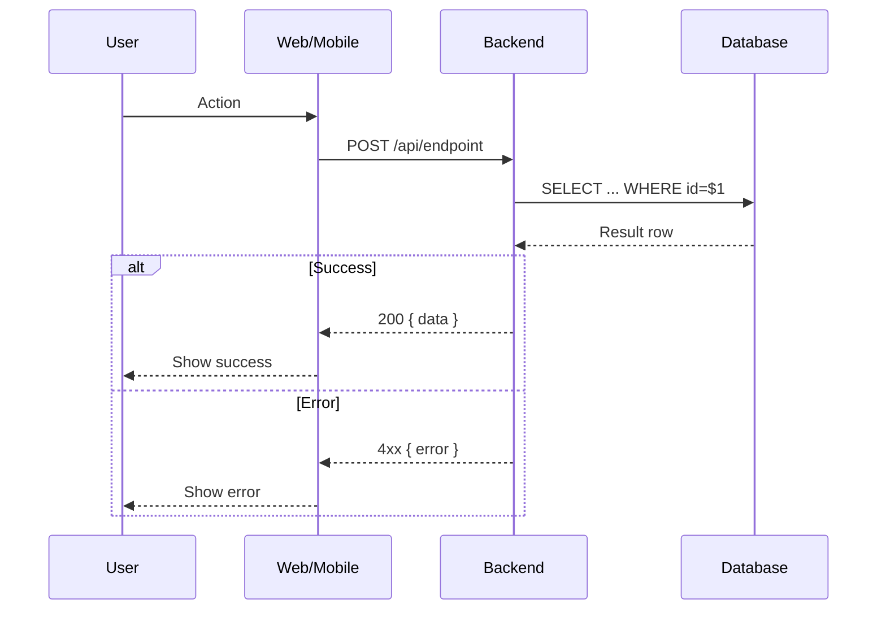

# Spec Template

> **MANDATORY**: Every spec written by a Builder MUST include all sections marked `[REQUIRED]`.
> Sections marked `[optional]` can be omitted if not applicable.
> The Architect will reject specs missing required sections at `spec-approval` gate.

---

# Spec XXXX: [Feature Name]

## Summary [REQUIRED]

One sentence describing what this feature does and why it exists.

## Goals [REQUIRED]

### Primary Goals

1. **Goal 1**: Brief description
2. **Goal 2**: Brief description

### Non-Goals

- What this spec explicitly does NOT cover
- Helps avoid scope creep during implementation

---

## Sequence Diagram [REQUIRED]

> Every spec MUST include a Mermaid sequence diagram showing component interactions.



---

## Architecture [REQUIRED]

### Affected Apps

- [ ] Backend (Go)
- [ ] Web (Next.js)
- [ ] Mobile (React Native)
- [ ] Shared packages

### Layer Breakdown

Describe which Clean Architecture layer each piece of work belongs to.

| Layer          | File / Component               | Responsibility              |
| -------------- | ------------------------------ | --------------------------- |
| Domain         | `internal/domain/entities/`    | Entity definition           |
| Domain         | `internal/domain/repository/`  | Repository interface        |
| Use Case       | `internal/usecase/`            | Business logic              |
| Infrastructure | `internal/adapter/repository/` | DB implementation           |
| Presentation   | `internal/adapter/handler/`    | HTTP handler                |

### Architecture Compliance Checklist

- [ ] Domain layer has zero external imports (no pgx, no HTTP, no API client)
- [ ] Use cases only depend on domain interfaces — never concrete implementations
- [ ] Repository implementations live in `infrastructure/` or `adapter/repository/`
- [ ] No ORM used in backend — raw SQL with pgx only
- [ ] Web/Mobile infrastructure calls Backend API — no direct DB access
- [ ] No circular dependencies between layers

---

## API Contract [optional]

> Required if this spec adds or modifies any HTTP endpoints.

### Endpoint: `POST /api/[resource]`

**Request:**
```json
{
  "field": "value"
}
```

**Response (200):**
```json
{
  "id": "uuid",
  "field": "value"
}
```

**Errors:**
| Status | Reason              |
| ------ | ------------------- |
| 400    | Invalid input       |
| 401    | Unauthorized        |
| 404    | Resource not found  |

---

## Database Changes [optional]

> Required if this spec adds or modifies database tables or migrations.

### New Migration: `NNN_description.up.sql`

```sql
CREATE TABLE IF NOT EXISTS example (
    id UUID PRIMARY KEY DEFAULT gen_random_uuid(),
    created_at TIMESTAMPTZ NOT NULL DEFAULT now()
);
```

### Down Migration: `NNN_description.down.sql`

```sql
DROP TABLE IF EXISTS example;
```

---

## Test Requirements [REQUIRED]

> This section is the most important for CI pass rate.
> Define ALL tests before writing any implementation code (TDD).

### Unit Tests

List each test function that MUST exist before implementation is considered complete.

| File | Test Name | Scenario | Expected |
| ---- | --------- | -------- | -------- |
| `usecase/create_X_test.go` | `TestCreateX_ValidInput_ReturnsCreated` | Valid input | Returns entity, no error |
| `usecase/create_X_test.go` | `TestCreateX_MissingField_ReturnsError` | Missing required field | Returns validation error |
| `usecase/create_X_test.go` | `TestCreateX_DuplicateEntry_ReturnsConflict` | Duplicate | Returns conflict error |
| `adapter/handler/X_test.go` | `TestHandleCreateX_Success_Returns201` | Valid request | HTTP 201 |
| `adapter/handler/X_test.go` | `TestHandleCreateX_InvalidBody_Returns400` | Invalid JSON | HTTP 400 |

### Integration Tests

List repository-level tests that require a real database connection.

| File | Test Name | What It Verifies |
| ---- | --------- | ---------------- |
| `adapter/repository/postgres_X_test.go` | `TestCreateX_Persists` | Row is written to DB |
| `adapter/repository/postgres_X_test.go` | `TestGetX_ReturnsCorrectRow` | Correct row is returned |

### Coverage Target

- **New files**: minimum **80%** line coverage
- **Critical paths** (auth, payments, data mutations): minimum **90%**
- Run locally before PR: `go test -coverprofile=coverage.out ./... && go tool cover -func=coverage.out`

### Test Naming Convention

Follow: `Test<Function>_<Scenario>_<Expected>`

Examples:
- ✅ `TestCreateUser_ValidInput_ReturnsUser`
- ✅ `TestGetAuditEvents_NoEvents_ReturnsEmptySlice`
- ❌ `TestCreateUser` (missing scenario and expected)
- ❌ `test_create_user` (wrong case)

---

## Acceptance Criteria [REQUIRED]

Testable, binary pass/fail criteria. Each criterion maps to at least one test.

- [ ] **AC1**: [Specific, measurable behavior] — tested by `TestXxx_Yyy_Zzz`
- [ ] **AC2**: [Specific, measurable behavior] — tested by `TestXxx_Yyy_Zzz`
- [ ] **AC3**: [Specific, measurable behavior] — tested by `TestXxx_Yyy_Zzz`
- [ ] **AC4**: Coverage ≥ 80% for all new files (verified by CI)
- [ ] **AC5**: All Clean Architecture constraints satisfied (verified by tdd-gate.yml)
- [ ] **AC6**: `./scripts/pre-pr-check.sh` passes with 0 failures

---

## Pre-PR Validation [REQUIRED]

> The Builder MUST run and paste the output of this script before creating a PR.
> The PR description must include the pre-pr-check output showing 0 failures.

```bash
./scripts/pre-pr-check.sh
```

Expected output before PR is opened:
```
══ All checks passed — safe to open PR ══
```

If any check fails, fix it before opening the PR. Do not open a PR with known failures.

---

## Implementation Notes [optional]

Guidance for the Builder on non-obvious implementation details.

- Note about a specific pattern to follow
- Note about a library to use or avoid
- Note about a tricky edge case

---

## Open Questions [optional]

Unresolved questions that need Architect input before or during implementation.

1. Should X be synchronous or async?
2. What should happen when Y is null?

---

**Status**: conceived
**Author**: [Architect / Builder]
**Date**: YYYY-MM-DD
